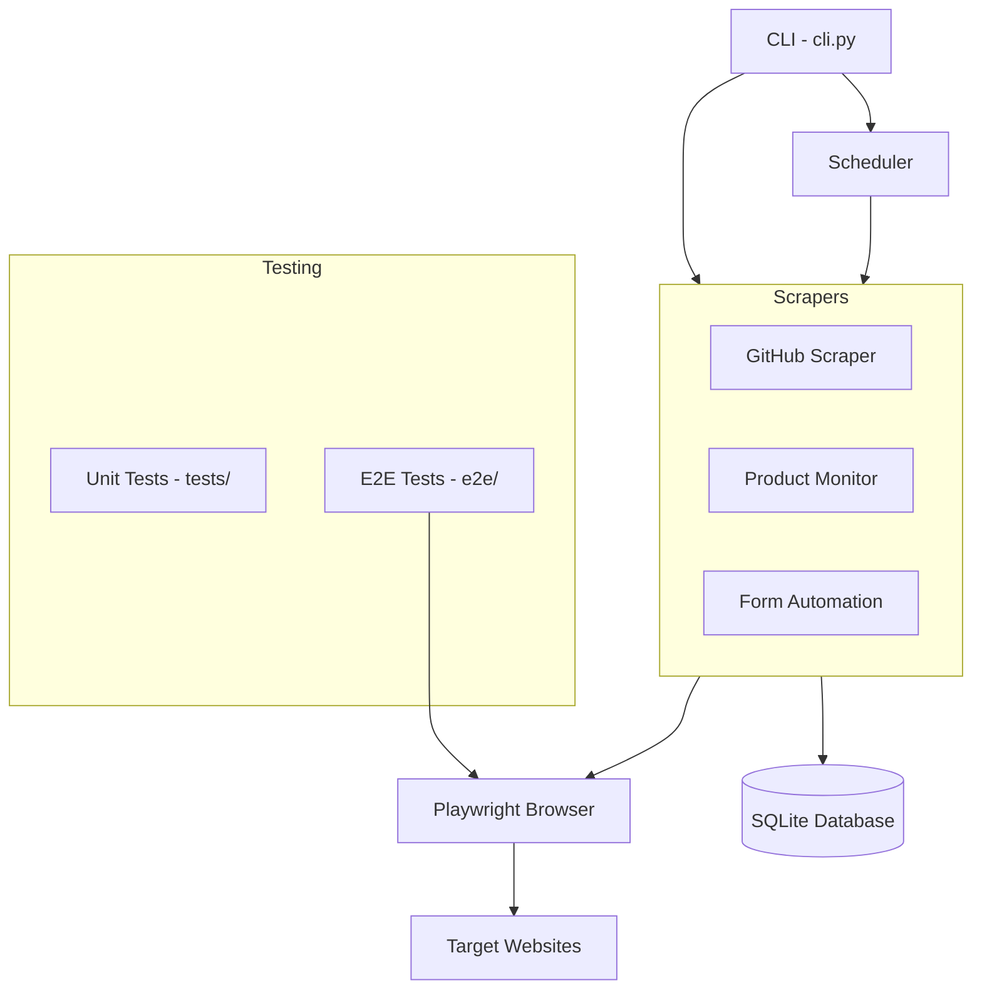

# Playwright Automation Suite


> Production-grade browser automation with real scraping, scheduled workflows, SQLite persistence, and E2E testing.

---

## Features

- **3 Real Scrapers** — GitHub trending repos, product price monitoring, form automation
- **SQLite Persistence** — Run history tracking, price change logs, structured data storage
- **Scheduler** — Automated periodic execution with configurable intervals
- **CLI Interface** — Run scrapers, view history, check prices from the terminal
- **E2E Test Suite** — 54 tests covering portfolio site, NexusForge, AI Playground, ImpulsoIA, and mobile responsive checks

---

## Architecture



---

## Tech Stack

| Component       | Technology            |
|-----------------|-----------------------|
| Language        | Python 3.12           |
| Browser Engine  | Playwright 1.49       |
| Database        | SQLite                |
| Testing         | pytest + pytest-playwright |
| CI/CD           | GitHub Actions        |
| Containerization| Docker                |

---

## Quick Start

```bash
# Clone the repository
git clone https://github.com/christianescamilla15-cell/playwright-automation.git
cd playwright-automation

# Install dependencies
pip install -r requirements.txt
playwright install chromium --with-deps

# Run all scrapers
python cli.py run all

# Start the scheduler
python cli.py schedule
```

---

## CLI Usage

```bash
# Run a specific scraper
python cli.py run github
python cli.py run products
python cli.py run forms

# Run all scrapers
python cli.py run all

# View run history
python cli.py history
python cli.py history --scraper github --limit 5

# Check price history for a product
python cli.py prices "Product Name"

# Start automated scheduler
python cli.py schedule
```

---

## Testing

```bash
# Run unit tests
python -m pytest tests/ -v

# Run E2E tests
python -m pytest e2e/ -v

# Run all tests
python -m pytest tests/ e2e/ -v
```

---

## Project Structure

```
playwright-automation/
├── cli.py                 # Command-line interface
├── requirements.txt       # Python dependencies
├── pytest.ini             # pytest configuration
├── Dockerfile             # Container build
├── .dockerignore          # Docker ignore rules
├── .github/
│   └── workflows/
│       └── ci.yml         # GitHub Actions CI
├── scrapers/
│   ├── github_scraper.py  # GitHub trending repos scraper
│   ├── product_monitor.py # Product price monitoring
│   └── form_automation.py # Form fill automation
├── storage/
│   └── database.py        # SQLite persistence layer
├── scheduler/
│   └── runner.py          # Scheduled execution engine
├── utils/
│   ├── browser.py         # Playwright browser helpers
│   └── retry.py           # Retry/backoff utilities
├── tests/
│   ├── test_github_scraper.py
│   ├── test_product_monitor.py
│   ├── test_form_automation.py
│   ├── test_database.py
│   └── test_scheduler.py
├── e2e/
│   ├── test_portfolio.py
│   ├── test_nexusforge.py
│   ├── test_ai_playground.py
│   ├── test_impulso_ia.py
│   └── test_mobile_responsive.py
├── data/                  # SQLite DB and JSON output
└── screenshots/           # Captured screenshots
```

---

## Docker

```bash
# Build the image
docker build -t playwright-automation .

# Run all tests in container
docker run --rm playwright-automation

# Run a specific scraper
docker run --rm playwright-automation python cli.py run github
```

---

## License

MIT License. See [LICENSE](LICENSE) for details.
